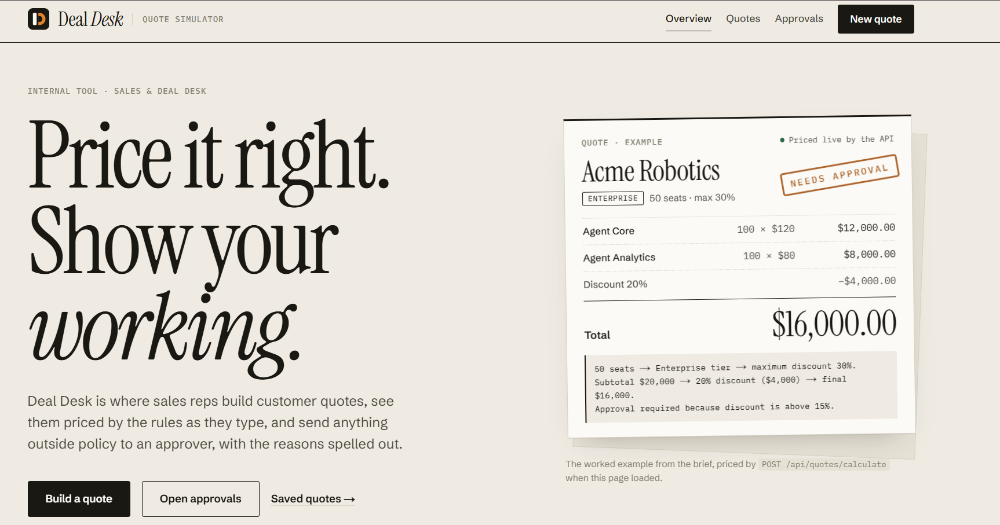
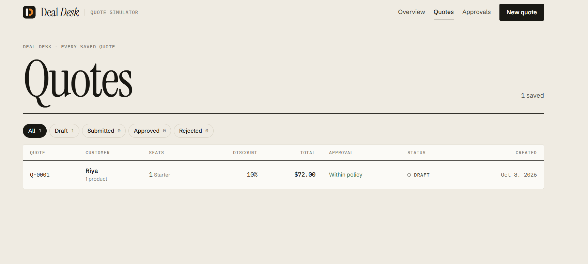
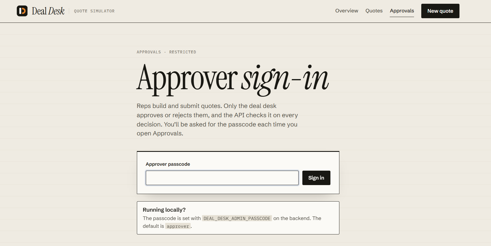

# Deal Desk Quote Simulator

A full-stack internal sales tool for creating customer quotes, calculating pricing in real time, determining approval requirements, saving quotes, and managing the review workflow.

## 🚀 Live Demo

[**Open the deployed application**](https://deal-pilot-sim.vercel.app/)

---

## 📸 Application Screenshots

<table>
  <tr>
    <td></td>
    <td></td>
  </tr>
  <tr>
    <td></td>
    <td></td>
  </tr>
</table>

---

## ✨ Overview

The **Deal Desk Quote Simulator** helps sales representatives create and manage customer quotes while automatically applying pricing and approval rules.

The application provides live pricing calculations, discount validation, approval detection, quote persistence, and an approval workflow for submitted quotes.

All business rules are handled by the backend API, while the frontend provides an interactive interface for creating and reviewing quotes.

---

## 🛠️ Tech Stack

| Layer        | Technology                       |
| ------------ | -------------------------------- |
| Frontend     | Next.js 16, React 19, TypeScript |
| Styling      | CSS Modules                      |
| Backend      | Python 3.12+, FastAPI, Pydantic  |
| API Server   | Uvicorn                          |
| Storage      | JSON file                        |
| Architecture | Full-stack REST API              |

---

## ✨ Features

### Quote Management

- Create customer quotes
- Add multiple products and quantities
- Specify number of seats
- Apply discounts
- Select annual commitment
- Save quotes
- View previously saved quotes
- Track quote status and history

### Pricing

- Real-time quote calculation
- Automatic seat-tier determination
- Product-level pricing
- Discount calculation
- Final quote total
- Automatic approval requirement detection
- Pricing explanation

### Approval Workflow

- Submit quotes for approval
- View submitted quotes
- Review approval reasons
- Approve or reject quotes
- Add optional approval notes
- Track status changes and history

### Additional Features

- Compare quote scenarios
- Draft recovery after refresh
- Catalog-change warnings
- Input validation
- API error handling
- Interactive API documentation

---

## 🏗️ Project Architecture

The application is divided into two main parts:

```text
                    ┌──────────────────────┐
                    │      Frontend        │
                    │   Next.js / React    │
                    └──────────┬───────────┘
                               │
                               │ REST API
                               ▼
                    ┌──────────────────────┐
                    │       Backend        │
                    │ FastAPI / Python     │
                    └──────────┬───────────┘
                               │
                               ▼
                    ┌──────────────────────┐
                    │     JSON Storage     │
                    │   quotes.json        │
                    └──────────────────────┘

```

The frontend communicates with the backend through REST API endpoints. Pricing and business rules are implemented on the backend.

---

## 📁 Project Structure

```text
deal-desk-quote-simulator/
│
├── backend/
│   ├── app/
│   │   ├── pricing.py       # Pricing and business rules
│   │   ├── catalog.py       # Product catalog
│   │   ├── models.py        # API schemas
│   │   ├── workflow.py      # Quote workflow
│   │   ├── store.py         # JSON persistence
│   │   └── main.py          # FastAPI application
│   │
│   ├── tests/
│   └── requirements.txt
│
├── frontend/
│   ├── src/
│   │   ├── app/             # Next.js routes
│   │   ├── components/      # UI components
│   │   └── lib/             # API client and utilities
│   │
│   └── package.json
│
├── data/
│   └── catalog.json
│
├── docs/
│   └── ASSIGNMENT.md
│
├── DECISIONS.md
└── README.md

```

---

# 💻 Running Locally

## Prerequisites

Make sure the following are installed:

- Python 3.12+
- Node.js 20.9+
- npm

---

## 1. Clone the Repository

```bash
git clone https://github.com/your-username/your-repository.git
cd your-repository

```

---

## 2. Start the Backend

Open a terminal and run:

```bash
cd backend

```

Create a virtual environment:

```bash
python -m venv .venv

```

### Windows PowerShell

```bash
.venv\Scripts\Activate.ps1

```

### Windows Command Prompt

```bash
.venv\Scripts\activate.bat

```

### macOS / Linux

```bash
source .venv/bin/activate

```

Install the dependencies:

```bash
pip install -r requirements.txt

```

Start the API:

```bash
uvicorn app.main:app --reload --port 8000

```

The backend will be available at:

```text
http://localhost:8000

```

Interactive API documentation:

```text
http://localhost:8000/docs

```

---

## 3. Start the Frontend

Open a second terminal:

```bash
cd frontend

```

Install dependencies:

```bash
npm install

```

Start the development server:

```bash
npm run dev

```

The frontend will be available at:

```text
http://localhost:3000

```

---

# 🚀 Deployment

The frontend and backend are deployed separately.

## Backend Deployment

The backend is deployed as a web service using Render.

### Configuration

**Root Directory**

```text
backend

```

**Build Command**

```bash
pip install -r requirements.txt

```

**Start Command**

```bash
uvicorn app.main:app --host 0.0.0.0 --port $PORT

```

### Backend Environment Variables

```text
DEAL_DESK_CORS_ORIGINS=https://deal-pilot-sim.vercel.app/
DEAL_DESK_ADMIN_PASSCODE=YOUR_SECURE_PASSCODE
PYTHON_VERSION=3.12.8

```

After deployment, verify the backend using:

```text
https://deal-pilot-5d8o.onrender.com/api/health

```

The health endpoint reports whether the catalog loaded correctly and whether quote storage is available.

---

## Frontend Deployment

The frontend is deployed using Vercel.

### Configuration

**Root Directory**

```text
frontend

```

The frontend uses the following environment variable:

```text
API_URL=https://deal-pilot-5d8o.onrender.com

```

> `API_URL` is read during the build process. Redeploy the frontend after changing this variable.

---

## 🌐 Deployment URLs

- **Live Application:** [Deal Desk](https://deal-pilot-sim.vercel.app/)
- **Backend API:** [Deal Pilot API](https://deal-pilot-5d8o.onrender.com)
- **API Documentation:** [FastAPI Docs](https://deal-pilot-5d8o.onrender.com/docs)

```


# 📱 Application Pages

| Route               | Description                                                             |
| ------------------- | ----------------------------------------------------------------------- |
| `/`                 | Application overview, pricing rules, worked example, and current counts |
| `/quotes`           | List and filter saved quotes                                            |
| `/quotes/new`       | Create and calculate a new quote                                        |
| `/quotes/:id`       | View quote details, pricing, approval status, and history               |
| `/admin`            | Approval dashboard                                                      |
| `/admin/quotes/:id` | Review, approve, or reject a submitted quote                            |

---

# 👥 User Roles

## Sales Representative

A representative can:

- Create quotes
- Calculate pricing
- Save quotes
- Submit quotes for approval
- View quote history

## Approver

An approver can:

- Access the approval queue
- Review submitted quotes
- View approval reasons
- Approve quotes
- Reject quotes
- Add optional notes

The default development passcode is:

```text
approver

```

For deployment, configure a secure passcode using:

```text
DEAL_DESK_ADMIN_PASSCODE

```

---

# 💰 Pricing & Approval Rules

The backend is the authoritative source for pricing and business rules.

The system calculates:

- Product prices
- Quantities
- Seat tiers
- Maximum allowed discounts
- Discount amount
- Final quote total
- Approval requirements

A quote may require approval when:

- The discount exceeds the configured threshold
- The quote total exceeds the configured threshold
- The annual commitment discount exceeds the configured threshold

---

# 🔌 API

The backend exposes a REST API through FastAPI.

## Health Check

```http
GET /api/health

```

## Product Catalog

```http
GET /api/catalog

```

## Calculate Quote

```http
POST /api/quotes/calculate

```

## Create Quote

```http
POST /api/quotes

```

## Get Quotes

```http
GET /api/quotes?status=

```

## Get Quote

```http
GET /api/quotes/{id}

```

## Update Quote Status

```http
PATCH /api/quotes/{id}/status

```

## Admin Session

```http
POST /api/admin/session

```

Full interactive API documentation is available at:

```text
https://deal-pilot-5d8o.onrender.com/docs

```

---

# 🧪 Testing

## Backend Tests

```bash
cd backend
python -m pytest

```

The backend tests cover business rules, API validation, workflow transitions, and catalog behavior.

## Frontend Tests

```bash
cd frontend
npm test

```

## Linting

```bash
cd frontend
npm run lint

```

## Type Checking

```bash
cd frontend
npm run typecheck

```

---

# 🔐 Environment Variables

## Backend

```text
DEAL_DESK_CORS_ORIGINS=
DEAL_DESK_ADMIN_PASSCODE=
DEAL_DESK_QUOTES_PATH=
PYTHON_VERSION=

```

## Frontend

```text
API_URL=

```

> Never commit production passwords, API keys, or other secrets to the repository.

---

# 💾 Data Storage

Quotes are stored in:

```text
backend/var/quotes.json

```

The current implementation uses JSON-file persistence rather than a database.

For production deployment, persistent storage should be configured if saved quotes need to survive service restarts.

---

# ⚠️ Known Limitations

- JSON-file storage is designed for a single process.
- It is not suitable for multiple API workers.
- Quote IDs are sequential.
- Saved quotes cannot currently be edited.
- The approval system uses a shared passcode instead of individual user accounts.
- Without persistent storage, saved quotes may be lost when the hosting service restarts.

---

# 🔮 Future Improvements

Potential improvements include:

- PostgreSQL or another production database
- User authentication
- Individual user accounts
- Role-based access control
- Persistent cloud storage
- Email notifications

---

# 📄 Documentation

Additional project documentation:

* [Assignment](docs/Assignment.md)
* [Design & Business Decisions](Decisions.md)

---

# 👨‍💻 Author

**Riya Chandra**

GitHub: https://github.com/riyachandraofficial

---

## ⭐ Project Demo

[**Launch the Deal Desk Quote Simulator**](https://deal-pilot-sim.vercel.app/)

Built with **Next.js, React, TypeScript, FastAPI, Python, and Pydantic**.
